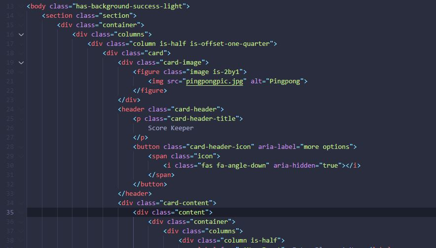
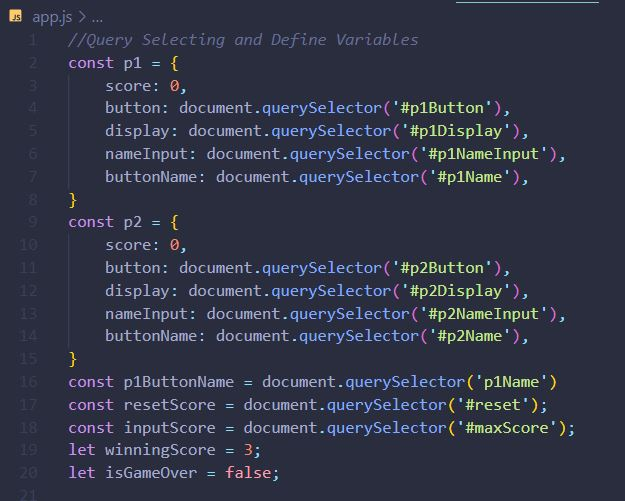
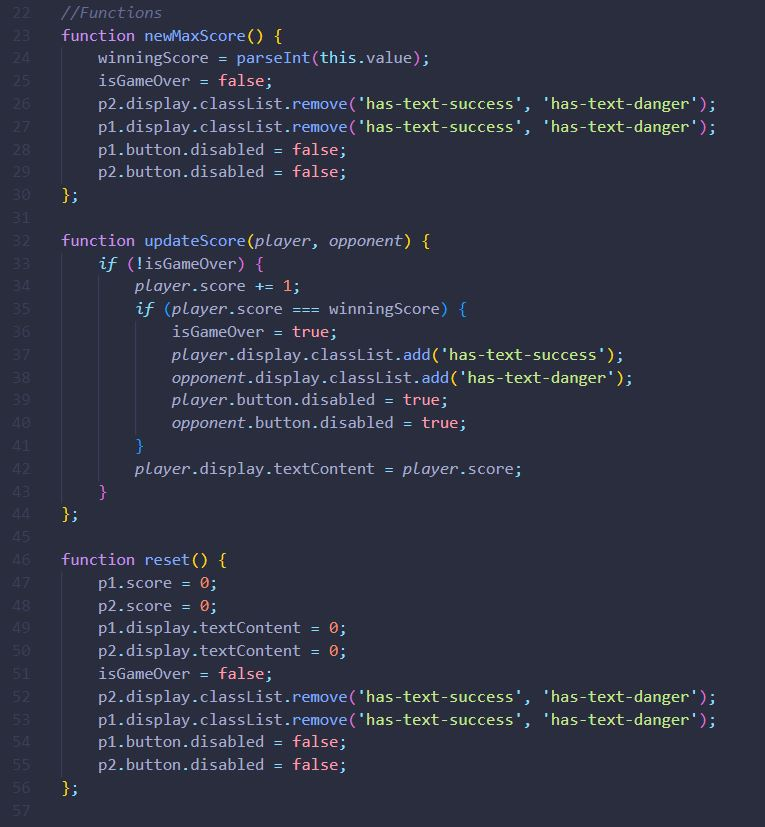
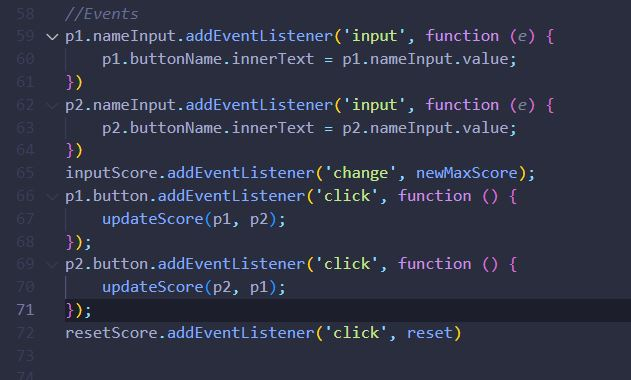
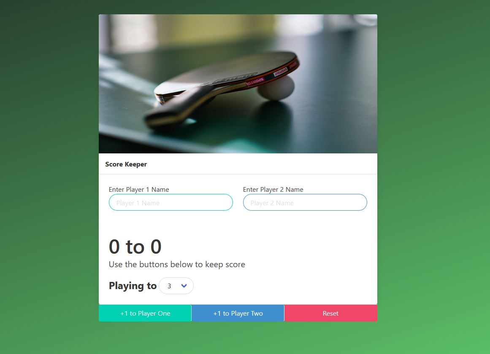
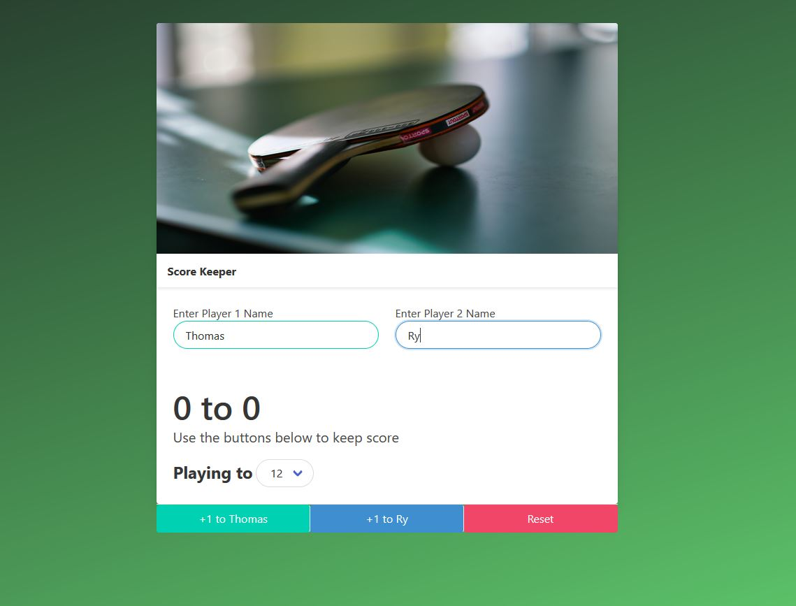
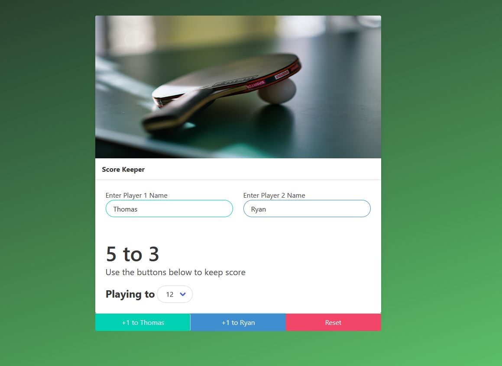
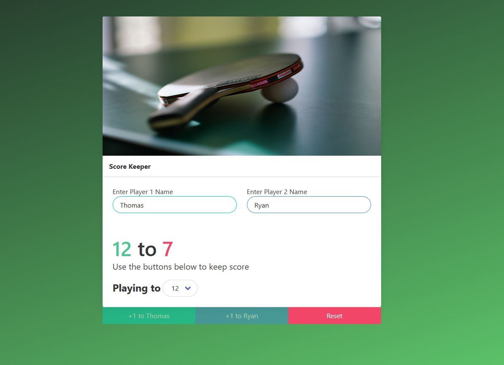
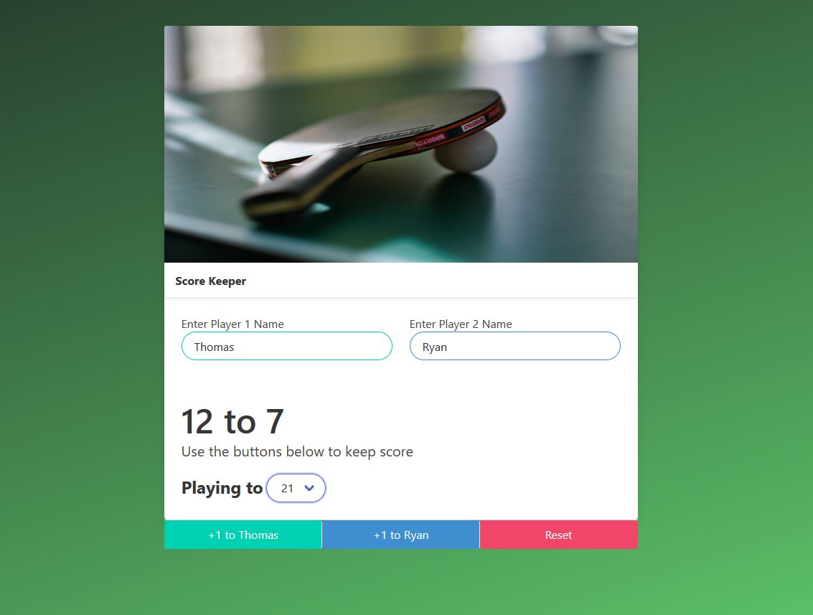
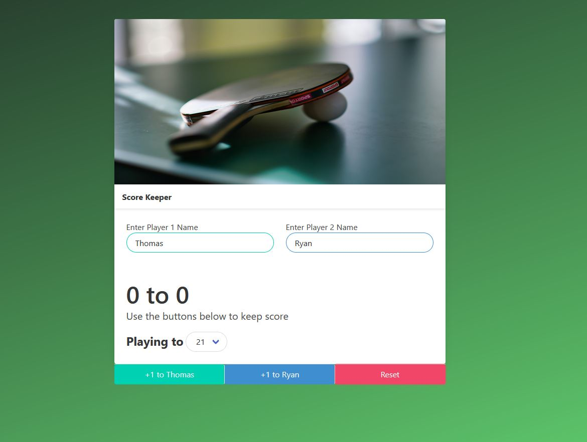

# Score-Keeper
## Another Project with HTML5 CSS3/Bulma and JS
This was a really fun project, as I got the chance to be creative with my CSS and JavaScript. Again my projects right now are originating from my coding
bootcamp on Udemy with [Colt Steele](https://www.udemy.com/courses/search/?q=colt+steele&src=sac&kw=colt "Colt Steele")

## Pictures and Description
### Explaination of Code
So I have imported pictures of my code to follow along with. This is a preview of my HTML document. In this picure you can see that I have
divs, figures, headers and other tags with multiple classes on them. After I linked Bulma in my head, I utilized these classes to pretty much do the CSS
for me. The classes did things such as add colors, borders, backgrounds, and positioning (and much more). Frameworks almost feel like I'm cheating on CSS.

  
 
The next few pictures are of my JavaScript code. In these pictures you can see that I broke down the code into 3 different sections, defining variables,
functions, and events. In doing this, I was able to simplify my code, by using variables of functions, and calling them within my functions for my event
listeners. 

The first picture shows my variables. It is simple querySelecting from my HTML, with a twist of putting the items within an object. This allowed me to
shorten the code by utilizing one function of updateScore, based off of which button was pressed. Basically it took away similar functions, and compressed
them into one. Which is shown by the secont picture of all of my functions. And then the third picture are all of my events which were very clean, and 
able to be easily followed.

First Picture

 

Second Picture

 

Third Picture

 

These last pictures are just displaying the UX part, and how the JS was implemented to do things like, changing player 1 and 2 name, selecting a max score,
and what happens when you hit the max score.

 

All in all, very fun project. I learned about organizing code, compressing code, cleaning it up, and making it easier to follow. What all this did too, 
was help me with debugging when functions were not being called properly, or when events were not happening.

Thank you for following along. Again I encourage critism, so please contact me and let me know what I could imrove or how I could make things easier to
follow.

### Thomas Wright
